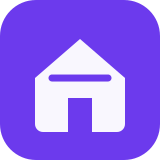

<div align="center">

  

  <h1>Aashiyana</h1>

  <p>
    <strong>A complete self-hosted household management platform</strong>
  </p>

  <p>
    <a href="https://github.com/AyushChandrawat/Aashiyana/releases">
      
    </a>
    <a href="https://github.com/AyushChandrawat/Aashiyana/stargazers">
      
    </a>
    <a href="https://github.com/AyushChandrawat/Aashiyana/pkgs/container/aashiyana">
      
    </a>
    <a href="LICENSE">
      
    </a>
  </p>

  <p>
    <a href="#installation"><strong>→ Install in Minutes</strong></a>
    &nbsp;·&nbsp;
    <a href="https://aashiyana.cloud/"><strong>Screenshots &amp; Tour</strong></a>
    &nbsp;·&nbsp;
    <a href="#documentation"><strong>Documentation</strong></a>
    &nbsp;·&nbsp;
    <a href="CHANGELOG.md"><strong>Changelog</strong></a>
  </p>

  <p>
    <strong>Project:</strong> Aashiyana
    &nbsp;·&nbsp;
    <strong>Owner / Developer:</strong> Ayush Chandrawat
    &nbsp;·&nbsp;
    <strong>GitHub:</strong> AyushChandrawat
  </p>

  <br>

  <picture>
    <source
      media="(prefers-color-scheme: dark)"
      srcset="docs/screenshots/de/dashboard-dark-web.webp"
    >
    
  </picture>

  <br><br>

  <sub>
    <b>20 Modules</b>
    &nbsp;·&nbsp;
    <b>24 Languages</b>
    &nbsp;·&nbsp;
    <b>0 Trackers</b>
    &nbsp;·&nbsp;
    Optional <b>AES-256</b> Database Encryption
    &nbsp;·&nbsp;
    <b>MIT</b> License
  </sub>

</div>

---

## About Aashiyana

Most households use multiple applications to manage everyday life.
Tasks, calendars, shopping lists, meals, recipes, finances, documents,
inventory, reminders, and family information are often spread across
different services.

**Aashiyana** brings these household tools together in one self-hosted
platform that you control.

Run Aashiyana on your own computer, home server, NAS, or Docker host.
Your household data stays under your control.

Each module is independent, so you can use the features you need while
keeping the rest disabled.

---

# Features

## One Platform Instead of Multiple Applications

| Instead of using... | Aashiyana provides |
|---|---|
| A task and to-do application | **Tasks** - Kanban boards, deadlines, priorities, recurring tasks, subtasks, tags, and multiple assignees |
| A shared calendar application | **Calendar** - Calendar synchronization, subscriptions, recurring events, holidays, and visibility controls |
| An expense-sharing application | **Shared Expenses** - Shared household expenses with debt simplification |
| A budgeting application | **Budget** - Income, expenses, accounts, loans, subscriptions, and savings goals |
| A meal planner | **Meals** - Weekly meal planning with shopping-list integration |
| A recipe application | **Recipes** - Create, duplicate, scale, and manage recipes |
| A shopping-list application | **Shopping** - Shared shopping lists organized by store aisle |
| A pantry tracker | **Pantry** - Stock levels, quantities, storage locations, and expiration dates |
| A document manager | **Documents** - Upload, tag, search, view, and organize household documents |
| A home inventory application | **Inventory** - Household possessions, purchase prices, warranties, conditions, and receipts |
| A notes application | **Notes** - Markdown notes and interactive checklists |
| A contact manager | **Contacts** - Contact management with CardDAV and vCard support |
| A family management application | **Family** - Household members, roles, profiles, photos, and invitations |
| A reminder application | **Reminders** - Tasks, events, subscriptions, warranties, and expiration reminders |
| A reward system | **Rewards** - Points, rewards, and household member accounts |
| A shift scheduling application | **Shift Schedule** - Rotating shifts, schedules, exceptions, and days off |
| A waste collection reminder | **Waste Collection** - Weekly and monthly waste collection schedules |
| A birthday reminder | **Birthdays** - Birthdays, age information, calendar events, and reminders |
| A backup application | **Backup** - Manual and scheduled backups with restore and rollback support |
| An API management system | **API Tokens** - Bearer tokens, X-API-Key authentication, OpenAPI, and MCP support |

---

# Modules Work Together

Aashiyana is designed so that its modules can communicate with each other.

### Meal Planning → Shopping

Add meals to the weekly meal plan and export their ingredients directly
to the shopping list.

### Pantry → Shopping

Track household stock and identify items that are running low or approaching
their expiration date.

### Tasks → Rewards

Completed tasks can award points to household members.

### Expenses → Inventory

Receipts and financial records can be linked to inventory items.

### Calendar → Reminders

Important events can generate reminders for household members.

---

# The 20 Modules

## 1. Tasks

Manage household tasks using Kanban boards.

Features include:

- Kanban boards
- Deadlines
- Priorities
- Subtasks
- Tags
- Recurring tasks
- Multiple assignees
- Comments
- Attached documents
- Activity history
- Task locking
- Completion tracking

---

## 2. Shopping

Create and manage shared shopping lists.

Features include:

- Shared lists
- Store aisle organization
- Custom shopping order
- Swipe gestures
- Meal-plan imports
- Email sharing
- Quantity management
- Item completion tracking

---

## 3. Meals

Plan household meals throughout the week.

Features include:

- Weekly meal planning
- Drag-and-drop scheduling
- Recipe integration
- Shopping-list export
- Meal organization

---

## 4. Recipes

Create and manage recipes.

Features include:

- Create recipes
- Edit recipes
- Duplicate recipes
- Scale ingredients
- Meal-plan integration
- Shopping-list integration
- Mealie integration
- Tandoor integration

---

## 5. Pantry

Keep track of household supplies.

Features include:

- Quantities
- Units
- Storage locations
- Minimum stock levels
- Expiration dates
- Low-stock filtering
- Expiration filtering
- Shopping-list integration

---

## 6. Calendar

Manage household events in one place.

Features include:

- Google Calendar synchronization
- CalDAV synchronization
- Outlook integration
- Microsoft Graph support
- Calendar subscriptions
- Recurring events
- Holidays
- Member filters
- Event visibility controls

---

## 7. Documents

Store and organize household documents.

Features include:

- File uploads
- Tags
- Search
- Document previews
- Document organization
- Local storage
- WebDAV storage
- Google Drive integration

---

## 8. Inventory

Manage household possessions.

Features include:

- Item tracking
- Purchase prices
- Warranty information
- Item condition
- Storage locations
- Receipts
- Expiration reminders

---

## 9. Budget

Manage household finances.

Features include:

- Income
- Expenses
- Accounts
- Loans
- Subscriptions
- Savings goals
- Categories
- Personal finances
- Shared finances
- Expense splitting

---

## 10. Household Management

Manage household helpers and related activities.

Features include:

- Work schedules
- Clock-in and clock-out
- Daily payments
- Hourly payments
- Tasks
- Material requests

---

## 11. Waste Collection

Manage waste collection schedules.

Features include:

- Weekly schedules
- Monthly schedules
- Waste categories
- Individual collection dates
- Rescheduling
- Skipping collection dates

---

## 12. Rewards

Create a reward system for household members.

Features include:

- Task points
- Member accounts
- Reward catalog
- Parent-controlled rewards
- Point history

---

## 13. Health

Store and view personal health information.

Features include:

- Vital measurements
- Medications
- Laboratory values
- Activity information
- Cycle information
- Member-specific records
- History and charts

> Aashiyana is not a medical device and does not provide medical diagnoses.

---

## 14. Shift Schedule

Manage rotating and fixed household schedules.

Features include:

- Rotating shifts
- Weekly schedules
- Configurable cycles
- Daily exceptions
- Days off
- Calendar integration

---

## 15. Notes & Contacts

Manage household notes and contacts.

Features include:

- Markdown notes
- Interactive checklists
- Contact management
- CardDAV synchronization
- vCard import
- vCard export

---

## 16. Birthdays

Keep track of important birthdays.

Features include:

- Birthday lists
- Optional name days
- Automatic calendar entries
- Age information
- Birthday reminders

---

## 17. Family

Manage household members.

Features include:

- Member profiles
- Roles
- Photos
- Contact information
- Invitation links
- Password setup
- Household membership management

---

## 18. Reminders

Manage reminders across the entire application.

Supported reminder types include:

- Tasks
- Calendar events
- Subscriptions
- Warranties
- Inventory deadlines
- Expiration dates

Notification channels include:

- In-app notifications
- Push notifications
- Gotify
- ntfy
- Webhooks
- Email

---

## 19. API Tokens

Access Aashiyana through its API.

Features include:

- Bearer authentication
- X-API-Key authentication
- OpenAPI 3.0 specification
- MCP endpoint
- AI-agent integration
- Idempotency-Key support

---

## 20. Backup

Protect household data with backups.

Features include:

- Manual backups
- Scheduled backups
- Database backups
- Restore
- Rollback
- Optional cloud uploads

---

# Additional Self-Hosted Features

## Wall Mode

Turn a tablet, wall-mounted display, or kitchen screen into a household
dashboard that can be viewed from across the room.

## Immich Screensaver

Display your own photos when the screen is idle using Immich integration.

---

# Installation

## Requirements

Aashiyana can run on:

- Windows
- Linux
- macOS
- Docker
- Podman
- Home servers
- NAS systems

Recommended minimum resources:

- 256 MB RAM
- Persistent storage
- One available network port

---

# Docker Installation

## Docker Image

```text
ghcr.io/ayushchandrawat/aashiyana:latest
````

## Download Configuration Files

```bash
curl -O https://raw.githubusercontent.com/AyushChandrawat/Aashiyana/main/docker-compose.yml
curl -O https://raw.githubusercontent.com/AyushChandrawat/Aashiyana/main/.env.example
```

Create your environment file:

```bash
cp .env.example .env
```

---

# Generate Secure Secrets

Generate a secure session secret:

```bash
openssl rand -hex 32
```

Generate a database encryption key:

```bash
openssl rand -hex 32
```

Add the values to `.env`:

```env
SESSION_SECRET=YOUR_GENERATED_SESSION_SECRET
DB_ENCRYPTION_KEY=YOUR_GENERATED_DATABASE_ENCRYPTION_KEY
```

> Keep your `DB_ENCRYPTION_KEY` in a safe location.
> If database encryption is enabled and the key is lost, the encrypted
> database may no longer be accessible.

---

# Start Aashiyana

```bash
docker compose up -d
```

Check the running container:

```bash
docker ps
```

Open Aashiyana in your browser:

```text
http://localhost:8090
```

The first visit will guide you through administrator account creation.

---

# Podman Installation

Download the Podman configuration:

```bash
curl -O https://raw.githubusercontent.com/AyushChandrawat/Aashiyana/main/podman-compose.yml
```

Start Aashiyana:

```bash
podman compose -f podman-compose.yml up -d
```

Then open:

```text
http://localhost:8090
```

---

# Local Development

Clone the repository:

```bash
git clone https://github.com/AyushChandrawat/Aashiyana.git
```

Enter the project directory:

```bash
cd Aashiyana
```

Install dependencies:

```bash
npm install
```

Create the environment file:

```bash
cp .env.example .env
```

Run the setup process:

```bash
npm run setup
```

Start the development server:

```bash
npm run dev
```

Start the production server:

```bash
npm start
```

The application will normally be available at:

```text
http://localhost:3001
```

When using the Docker configuration provided by this project, access it through:

```text
http://localhost:8090
```

---

# Environment Configuration

Example `.env` configuration:

```env
NODE_ENV=production

PORT=3001

SESSION_SECRET=REPLACE_WITH_A_SECURE_RANDOM_VALUE

DB_ENCRYPTION_KEY=REPLACE_WITH_A_SECURE_RANDOM_VALUE

TZ=Asia/Kolkata
```

Generate a secure secret using Node.js:

```bash
node -e "console.log(require('crypto').randomBytes(32).toString('hex'))"
```

Never publish your `.env` file or commit it to GitHub.

---

# Data Storage

The main SQLite database is stored at:

```text
/data/aashiyana.db
```

A Docker deployment can use persistent volumes such as:

```yaml
volumes:
  - aashiyana_data:/data
  - aashiyana_backups:/backups
  - aashiyana_modules:/modules
  - aashiyana_documents:/documents
```

Your persistent data should always be included in your backup strategy.

---

# Security

Aashiyana is designed for self-hosted environments.

Security features include:

* Optional database encryption
* Session authentication
* Optional two-factor authentication
* TOTP recovery codes
* OIDC / Single Sign-On support
* Invitation-based membership
* Password reset
* API authentication
* Role-based permissions
* Server-side request protection
* No mandatory external account
* No telemetry by default

For security information, see:

```text
SECURITY.md
```

---

# Privacy

Aashiyana is designed around self-hosting and user control.

Your household data remains on your own infrastructure unless you
explicitly configure an external integration.

External integrations may include:

* Google Calendar
* Microsoft Graph
* Google Drive
* WebDAV
* Mealie
* Tandoor
* Immich
* Gotify
* ntfy
* Email
* Webhooks

These services are optional.

---

# Backup Recommendations

Always maintain backups of:

```text
/data
/backups
/documents
```

If documents are stored externally, such as on:

* Google Drive
* WebDAV
* External folders

those locations should be backed up separately.

---

# Why Aashiyana?

## Your Data Stays Under Your Control

Aashiyana is self-hosted.

You decide:

* Where it runs
* Who can access it
* Where the database is stored
* Where documents are stored
* How backups are created
* Which integrations are enabled

## No Mandatory Subscription

Aashiyana is designed to run without a required subscription.

## No Mandatory Cloud Account

You can run the core application entirely on your own infrastructure.

## Modular Design

Use only the modules your household needs.

## Open Source

Aashiyana is released under the MIT License.

---

# Technology

Aashiyana uses modern web technologies.

<p align="center">
  
  
  
  
  
  
  
  
</p>

---

# Project Structure

```text
Aashiyana/
│
├── public/
│   ├── pages/
│   ├── assets/
│   ├── i18n.js
│   ├── lang-init.js
│   └── index.html
│
├── server/
│   ├── index.js
│   ├── routes/
│   ├── middleware/
│   └── services/
│
├── modules/
│
├── docs/
│   ├── SPEC.md
│   ├── installation.md
│   └── ...
│
├── setup.js
├── package.json
├── docker-compose.yml
├── podman-compose.yml
├── .env.example
├── SECURITY.md
├── CHANGELOG.md
├── MODULES.md
├── CONTRIBUTING.md
├── LICENSE
└── README.md
```

---

# Documentation

The project documentation includes:

* [Installation Guide](docs/installation.md)
* [Specification & Data Model](docs/SPEC.md)
* [Custom Modules](MODULES.md)
* [Notification Webhooks](docs/notification-webhooks.md)
* [Immich Screensaver](docs/immich-screensaver.md)
* [Contributing Guide](CONTRIBUTING.md)
* [Release Guide](docs/RELEASING.md)
* [Security Policy](SECURITY.md)
* [Changelog](CHANGELOG.md)
* [Backlog](BACKLOG.md)
* [Project Scope](docs/SCOPE.md)
* [Architecture Decisions](docs/DECISIONS.md)
* [Roadmap](docs/ROADMAP.md)

---

# API

Aashiyana provides API access for integrations and automation.

Supported authentication methods include:

```text
Bearer Token
X-API-Key
```

The API includes an OpenAPI 3.0 specification.

An MCP endpoint is also available for supported AI-agent integrations.

---

# Development Guidelines

When contributing to Aashiyana:

* Keep existing functionality working.
* Avoid unnecessary dependencies.
* Protect user privacy.
* Keep the application self-hosted.
* Use English for new user-facing text.
* Maintain responsive design.
* Keep modules independent where possible.
* Document important configuration changes.
* Do not commit secrets or `.env` files.
* Test changes before submitting them.

---

# Contributing

Contributions are welcome.

Before submitting changes, read:

```text
CONTRIBUTING.md
```

You can contribute through:

* Bug reports
* Feature requests
* Documentation improvements
* UI improvements
* Translations
* Performance improvements
* Security improvements
* New integrations
* New modules

---

# Developer Information

| Property          | Value                                        |
| ----------------- | -------------------------------------------- |
| Project Name      | **Aashiyana**                                |
| Owner / Developer | **Ayush Chandrawat**                         |
| GitHub Username   | **AyushChandrawat**                          |
| Repository        | **AyushChandrawat/Aashiyana**                |
| Default Language  | **English**                                  |
| License           | **MIT**                                      |
| Container Image   | **ghcr.io/ayushchandrawat/aashiyana:latest** |

---

# License

Aashiyana is released under the MIT License.

See the following file for the complete license text:

```text
LICENSE
```

---

<div align="center">

  <br>

  <h2>Take Back Control of Your Household Data.</h2>

  <p>
    Install Aashiyana once and keep control of your household data.
    <br>
    Run it on your own server, computer, or NAS.
    <br>
    No mandatory subscription and no mandatory external account.
  </p>

  <br>

  <p>
    <a href="https://github.com/AyushChandrawat/Aashiyana">
      <strong>View Aashiyana on GitHub</strong>
    </a>
    &nbsp;·&nbsp;
    <a href="https://github.com/AyushChandrawat/Aashiyana/discussions">
      <strong>Ask a Question</strong>
    </a>
  </p>

  <br>

  <p>
    <strong>Aashiyana</strong>
  </p>

  <p>
    Owner / Developer:
    <strong>Ayush Chandrawat</strong>
  </p>

  <sub>
    MIT Licensed · Aashiyana · Ayush Chandrawat
  </sub>

</div>
